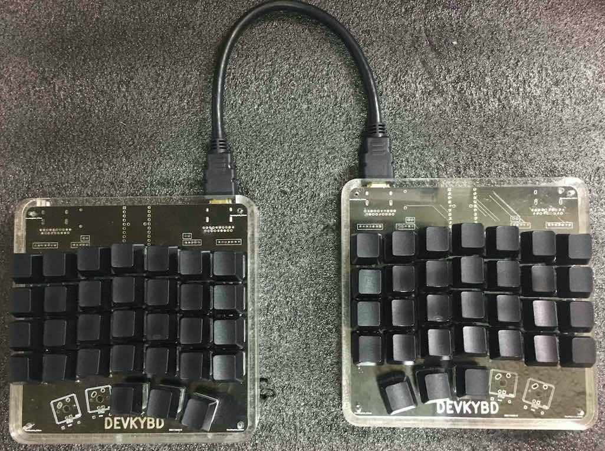

devkey black 
======================
Refer to build [tmk_core/doc/build.md](../../tmk_core/doc/build.md) for build
instructions.

#### default layer
    .---------------------------.        .---------------------------.        
    |  `|  1|  2|  3|  4|  5| PU|        |  =|  6|  7|  8|  9|  0|  -|
    |---------------------------|        |---------------------------|
    |TAB|  Q|  W|  E|  R|  T| PD|        |CAP|  Y|  U|  I|  O|  P|ESC|
    |---------------------------|        |---------------------------|
    |LCL|  A|  S|  D|FN3|  G|FN0|        |ENT|  H|  J|  K|  L|  :|  '|
    |---------------------------|        |---------------------------|
    |LST|  Z|  X|  C|  V|  B|ESC|        |BSP|  N|  M|  ,|  .|  /|RST|
    `---------------------------'        `---------------------------'
                |LAT|WIN|FN2|                |FN1|ENT|FN13|            
                `-----------'                `------------'            

#### function layer 
When FN3 is tapped, it produced the 'f' key.  When it is pressed and held,
it turns on the function layer.

    .---------------------------.        .---------------------------.        
    |   | F1| F2| F3| F4| F5|ESC|        |F12| F6| F7| F8| F9|F10|F11|
    |---------------------------|        |---------------------------|
    |   |   |   |   |   |VLU|VLD|        |   | ML| MD| MU| MR| PS|   |
    |---------------------------|        |---------------------------|
    |   |   |   |   |   |   |   |        |   | CL| CD| CU| CR|   |   |
    |---------------------------|        |---------------------------|
    |   |   |   |   |   |   |   |        |   |   |   |   |   |   |   |
    `---------------------------'        `---------------------------'
                |   |   |   |                |MB1|MB2|MB3|            
                `-----------'                `-----------'            

#### left space
When FN2 is tapped, it produced the 'space' key.  When it is pressed and held,
it turns on the left space layer.

    .---------------------------.        .---------------------------.        
    |   |   |   |   |   |   |   |        |   |   |   |   |   |   |   |
    |---------------------------|        |---------------------------|
    |   |   |   |   |   |   |   |        |   |  ~|  /|  \|  {|  }|   |
    |---------------------------|        |---------------------------|
    |   |   |   |   |   |   |   |        |   |  `|  [|  ]|  (|  )|   |
    |---------------------------|        |---------------------------|
    |   |   |   |   |   |   |   |        |   |  -|  +|  =|  ||  /|   |
    `---------------------------'        `---------------------------'
                |   |   |   |                | BS|ESC|   |            
                `-----------'                `-----------'            

#### right space 
When FN2 is tapped, it produced the 'space' key.  When it is pressed and held,
it turns on the left space layer.

    .---------------------------.        .---------------------------.        
    |   |   |   |   |   |   |   |        |   |   |   |   |   |   |   |
    |---------------------------|        |---------------------------|
    |   |   |  #|  $|  %|  &|   |        |   |   |   |   |   |   |   |
    |---------------------------|        |---------------------------|
    |   |  <|  >|  {|  }|  ^|   |        |   |   |   |   |   |   |   |
    |---------------------------|        |---------------------------|
    |   |   |  *|  !|  @|  _|   |        |   |   |   |   |   |   |   |
    `---------------------------'        `---------------------------'
                |   |   | BS|                |   |   |   |            
                `-----------'                `-----------'            

